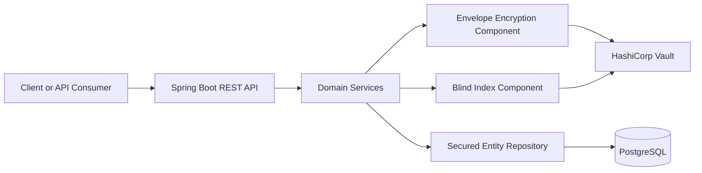

# Application Level Encryption

This repository contains a Spring Boot implementation for application-level field encryption using envelope encryption, blind indexing, Vault-backed key management, and PostgreSQL persistence.

**IMPORTANT DISCLAIMER**: **NOT PRODUCTION GRADE**

## Summary

The application protects sensitive fields before they are persisted by combining the following controls:

- AES-256-GCM envelope encryption for secret payloads
- Vault transit wrapping for data-encryption-key lifecycle support
- Blind index exact-match search using HMAC-derived indexes
- Operational key-rotation workflows for KEK and BIK handling
- Integration and e2e validation using Spring Boot tests and Testcontainers

## Technology Stack

- Java 21
- Spring Boot 3.5.x
- Maven
- PostgreSQL
- HashiCorp Vault
- JUnit 5
- Testcontainers

## Codebase Layout

Key top-level paths:

- `src/main/`: application source code
- `src/test/`: unit, integration, and e2e tests
- `vault/`: Vault bootstrap assets and validation scripts
- `docs/`: runbooks and supporting documentation
- `postman/`: Postman collection and environment files

## Architecture

The following high-level view shows the main runtime components and trust boundaries:



The API layer exposes CRUD, search, and key-rotation operations. Domain services orchestrate encryption, blind index generation, and repository access. Vault provides key-management support, while PostgreSQL stores encrypted records and blind indexes.

## Local Development

The primary local workflow is documented in [docs/local-development-workflow.md](docs/local-development-workflow.md).

Typical prerequisites:

- Docker/podman with Compose plugin
- Java 21 or later
- Maven 3.9 or later

## Testing And Validation

Run the full automated test suite:

```bash
mvn -q test
```

## REST API And Postman

The application exposes REST endpoints for secured-entity lifecycle operations and key-rotation workflows.

Plaintext handling note:

- `decryptedSecretInfo` is **not** returned by default.
- Only `GET /v1/entities/{entityId}` and `POST /v1/entities/search` can return it.
- Callers must explicitly pass `includeDecrypted=true` on those two endpoints to receive plaintext in the response.

### API Endpoint Summary

| Method | Path | Purpose |
| ------ | ---- | ------- |
| `GET` | `/v1/entities` | List secured entities with pagination. Never returns `decryptedSecretInfo`. |
| `POST` | `/v1/entities` | Create a secured entity. Never returns `decryptedSecretInfo`. |
| `GET` | `/v1/entities/{entityId}` | Retrieve a secured entity by ID. Supports `?includeDecrypted=true`. |
| `PUT` | `/v1/entities/{entityId}` | Update a secured entity. Never returns `decryptedSecretInfo`. |
| `DELETE` | `/v1/entities/{entityId}` | Delete a secured entity. |
| `POST` | `/v1/entities/search` | Execute exact-match secret search. Supports `?includeDecrypted=true`. |
| `POST` | `/v1/admin/keys/kek/rotate` | Trigger KEK rotation |
| `POST` | `/v1/admin/keys/bik/rotate` | Trigger BIK rotation |
| `GET` | `/v1/admin/keys/rotations/{rotationId}` | Retrieve key-rotation plan status |

### Decrypted Response Opt-In

Use the `includeDecrypted` query parameter only when a caller must receive plaintext in the API response.

Examples:

```text
GET /v1/entities/{entityId}?includeDecrypted=true
POST /v1/entities/search?includeDecrypted=true
```

When the flag is omitted or set to `false`, the API still returns the encrypted fields such as `secretCipher`, `secretDek`, and `secretBidx`, but omits `decryptedSecretInfo` entirely.

Postman assets are available here:

- [postman/app-level-encryption.postman_collection.json](postman/app-level-encryption.postman_collection.json)
- [postman/app-level-encryption.local.postman_environment.json](postman/app-level-encryption.local.postman_environment.json)

The Postman collection includes paired requests for the detail and search endpoints so you can validate both the default-safe response and the `includeDecrypted=true` opt-in response.

Default local base URL:

```text
http://localhost:8080
```

## Current Scope

This repository currently emphasizes implementation and validation of:

- secured entity CRUD and exact-match search flows
- envelope encryption and blind indexing components
- Vault bootstrap and startup resilience behavior
- key rotation workflows and contract validation

The implementation **IS NOT PRODUCTION GRADE** but only a showcase. **DO NOT USE IN PRODUCTION** UNLESS REVIEWED AND VETTED.

Other than that, enjoy your stay and *you can checkout any time you like...*.
If this repo helps you in any chance, target achieved!

Cheers, and remember, *the bards' songs will remain*.

PS: Did I mention that this is **NOT BATTLE-TESTED & PRODUCTION READY**?
